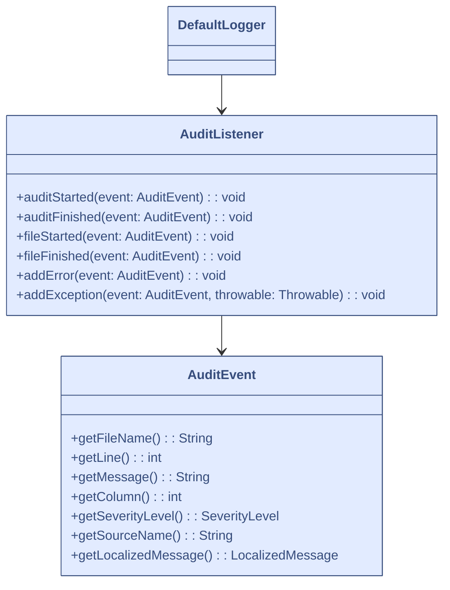

```mermaid
classDiagram
direction TB
    class DefaultLogger {
    }

    class AuditListener {
        +auditStarted(event: AuditEvent) : void
        +auditFinished(event: AuditEvent) : void
        +fileStarted(event: AuditEvent) : void
        +fileFinished(event: AuditEvent) : void
        +addError(event: AuditEvent) : void
        +addException(event: AuditEvent, throwable: Throwable) : void
    }

    class AuditEvent {
        +getFileName() : String
        +getLine() : int
        +getMessage() : String
        +getColumn() : int
        +getSeverityLevel() : SeverityLevel
        +getSourceName() : String
        +getLocalizedMessage() : LocalizedMessage
    }

    DefaultLogger --> AuditListener
    AuditListener --> AuditEvent

    class DefaultLogger:::Sky
    class AuditListener:::Sky
    class AuditEvent:::Sky

    classDef Sky :,stroke-width:1px, stroke-dasharray:none, stroke:#374D7C, fill:#E2EBFF, color:#374D7C
```
