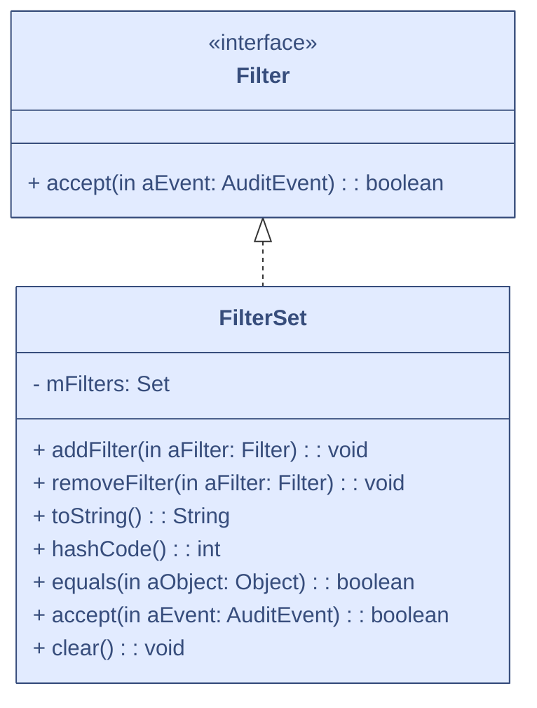

```mermaid
classDiagram
    direction TB
    class Filter {
        + accept(in aEvent: AuditEvent): boolean
    }

    class FilterSet {
        - mFilters: Set
        + addFilter(in aFilter: Filter): void
        + removeFilter(in aFilter: Filter): void
        + toString(): String
        + hashCode(): int
        + equals(in aObject: Object): boolean
        + accept(in aEvent: AuditEvent): boolean
        + clear(): void
    }

    <<interface>> Filter
    Filter <|.. FilterSet

    class Filter:::Sky
    class FilterSet:::Sky

classDef Sky:, stroke-width:1px, stroke-dasharray:none, stroke:#374D7C, fill:#E2EBFF, color:#374D7C
```