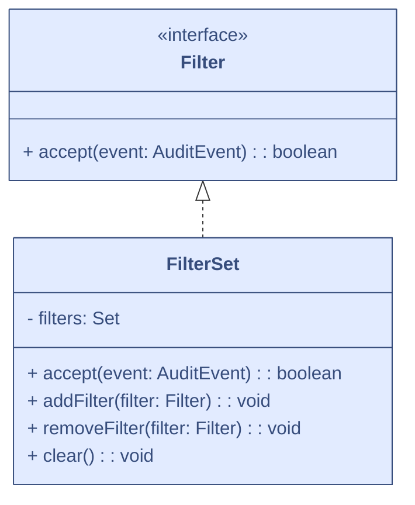

```mermaid
classDiagram
    direction TB

    class Filter {
        + accept(event: AuditEvent): boolean
    }

    class FilterSet {
        + accept(event: AuditEvent): boolean

        
        - filters: Set
        + addFilter(filter: Filter): void
        + removeFilter(filter: Filter): void
        + clear(): void
    }

    <<interface>> Filter
    Filter <|.. FilterSet

    class Filter:::Sky
    class FilterSet:::Sky

classDef Sky fill:#E2EBFF,stroke:#374D7C,stroke-width:1px,color:#374D7C
```